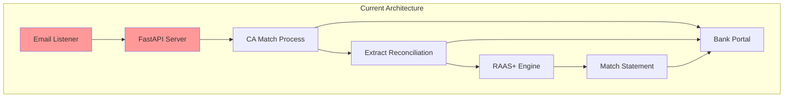
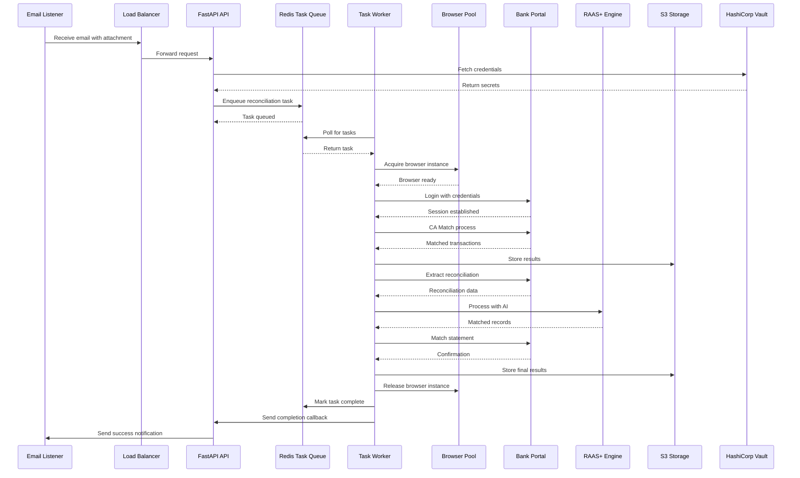
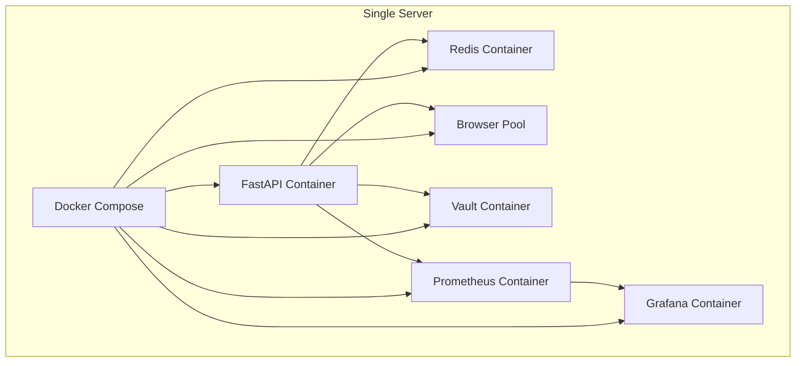
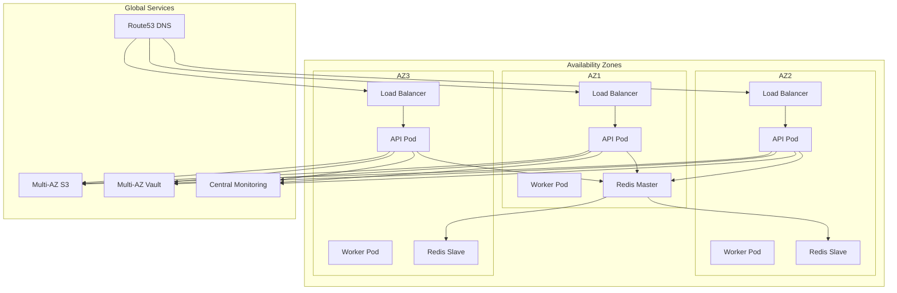

# Production Readiness Roadmap
## Playwright-Based Bank Transaction Reconciliation Automation System

**Document Version:** 1.0  
**Created:** 2026-02-19  
**Status:** Planning Phase

---

## Executive Summary

This roadmap provides a comprehensive plan to transform the Playwright-based bank transaction reconciliation RPA system from development/testing to production-ready status. The system automates a 4-step workflow: **CA Match → Extract Reconciliation → RAAS+ Engine → Match Statement**.

**Current State:** Functional but not production-ready  
**Target State:** Enterprise-grade, highly available, secure, and scalable system  
**Timeline:** 16 weeks (4 phases)  
**Estimated Effort:** 10-20 weeks of focused development

---

## Table of Contents

1. [System Architecture](#1-system-architecture)
2. [Deployment Architecture](#2-deployment-architecture)
3. [High Availability Design](#3-high-availability-design)
4. [Feature Specifications](#4-feature-specifications)
5. [Phased Implementation Roadmap](#5-phased-implementation-roadmap)
6. [Technology Stack Recommendations](#6-technology-stack-recommendations)
7. [Implementation Guide](#7-implementation-guide)

---

## 1. System Architecture

### 1.1 Current Architecture



**Current Issues:**
- Sequential execution (no parallelization)
- Single point of failure (no HA)
- No task queue (in-memory only)
- No browser pooling
- Fixed timeouts
- No distributed tracing
- Plaintext credentials

### 1.2 Target Production Architecture

```mermaid
graph TB
    subgraph "External Systems"
        BankPortal[Bank Portal]
        GraphAPI[Microsoft Graph API]
        EmailServer[Email Server]
        OpenRouter[OpenRouter AI API]
    end
    
    subgraph "Load Balancer"
        LB[Application Load Balancer]
    end
    
    subgraph "API Gateway Layer"
        APIGW[API Gateway]
    end
    
    subgraph "Application Layer - Worker Nodes"
        subgraph "Worker 1"
            W1API[FastAPI Instance]
            W1Queue[Task Worker]
            W1Browser[Browser Pool]
        end
        subgraph "Worker 2"
            W2API[FastAPI Instance]
            W2Queue[Task Worker]
            W2Browser[Browser Pool]
        end
        subgraph "Worker N"
            WNAPI[FastAPI Instance]
            WNQueue[Task Worker]
            WNBrowser[Browser Pool]
        end
    end
    
    subgraph "Task Queue Layer"
        Redis[Redis Task Queue]
        DLQ[Dead Letter Queue]
    end
    
    subgraph "Data Layer"
        S3[S3 Storage]
        Backup[Backup Storage]
    end
    
    subgraph "Observability Layer"
        Prometheus[Prometheus]
        Grafana[Grafana Dashboard]
        Jaeger[Jaeger Tracing]
        ELK[ELK Stack]
        PagerDuty[PagerDuty Alerting]
    end
    
    subgraph "Security Layer"
        Vault[HashiCorp Vault]
        WAF[Web Application Firewall]
    end
    
    subgraph "CI/CD Layer"
        GitHub[GitHub Actions]
        Docker[Docker Registry]
    end
    
    EmailServer --> LB
    LB --> APIGW
    APIGW --> W1API
    APIGW --> W2API
    APIGW --> WNAPI
    
    W1API --> Redis
    W2API --> Redis
    WNAPI --> Redis
    
    W1Queue --> Redis
    W2Queue --> Redis
    WNQueue --> Redis
    
    W1Queue --> DLQ
    W2Queue --> DLQ
    WNQueue --> DLQ
    
    W1Browser --> BankPortal
    W2Browser --> BankPortal
    WNBrowser --> BankPortal
    
    W1API --> GraphAPI
    W2API --> GraphAPI
    WNAPI --> GraphAPI
    
    W1API --> OpenRouter
    W2API --> OpenRouter
    WNAPI --> OpenRouter
    
    W1API --> S3
    W2API --> S3
    WNAPI --> S3
    
    S3 --> Backup
    
    W1API --> Prometheus
    W2API --> Prometheus
    WNAPI --> Prometheus
    
    Prometheus --> Grafana
    Prometheus --> PagerDuty
    
    W1API --> Jaeger
    W2API --> Jaeger
    WNAPI --> Jaeger
    
    W1API --> ELK
    W2API --> ELK
    WNAPI --> ELK
    
    W1API --> Vault
    W2API --> Vault
    WNAPI --> Vault
    
    LB --> WAF
    
    GitHub --> Docker
    Docker --> W1API
    Docker --> W2API
    Docker --> WNAPI
```



### 1.3 Data Flow Architecture



### 1.4 Component Specifications

#### 1.4.1 API Gateway Layer
- **Purpose:** Single entry point for all requests
- **Features:** Rate limiting, authentication, request routing
- **Technology:** Kong, AWS API Gateway, or Nginx

#### 1.4.2 Application Layer
- **Purpose:** Execute reconciliation workflows
- **Components:** FastAPI instances, Task workers, Browser pools
- **Scaling:** Horizontal auto-scaling based on queue depth

#### 1.4.3 Task Queue Layer
- **Purpose:** Decouple task submission from execution
- **Features:** Persistent storage, priority queues, dead letter queue
- **Technology:** Redis with Celery or RabbitMQ

#### 1.4.4 Browser Pool Layer
- **Purpose:** Efficient browser instance management
- **Features:** Connection pooling, context reuse, resource limits
- **Technology:** Custom pool manager with Playwright

#### 1.4.5 Data Layer
- **Purpose:** Persistent storage for results and logs
- **Features:** Versioned storage, lifecycle policies, backup
- **Technology:** AWS S3 or MinIO

#### 1.4.6 Observability Layer
- **Purpose:** Monitor system health and performance
- **Features:** Metrics collection, distributed tracing, log aggregation
- **Technology:** Prometheus, Grafana, Jaeger, ELK Stack

#### 1.4.7 Security Layer
- **Purpose:** Protect secrets and secure communication
- **Features:** Secret management, encryption, WAF
- **Technology:** HashiCorp Vault, AWS WAF

---

## 2. Deployment Architecture

### 2.1 Single-Node Deployment (Development/Testing)



**Use Case:** Development, testing, and low-volume production  
**Pros:** Simple setup, low cost, easy to debug  
**Cons:** Single point of failure, limited scalability

### 2.2 Multi-Node Deployment (Production)

```mermaid
graph TB
    subgraph "Kubernetes Cluster"
        subgraph "Ingress"
            Ingress[NGINX Ingress Controller]
        end
        
        subgraph "FastAPI Deployment"
            API1[FastAPI Pod 1]
            API2[FastAPI Pod 2]
            API3[FastAPI Pod N]
        end
        
        subgraph "Worker Deployment"
            Worker1[Worker Pod 1]
            Worker2[Worker Pod 2]
            Worker3[Worker Pod N]
        end
        
        subgraph "Redis Deployment"
            RedisMaster[Redis Master]
            RedisSlave1[Redis Slave 1]
            RedisSlave2[Redis Slave 2]
        end
        
        subgraph "Supporting Services"
            Vault[Vault Deployment]
            Prometheus[Prometheus Deployment]
            Grafana[Grafana Deployment]
            Jaeger[Jaeger Deployment]
        end
    end
    
    subgraph "External Services"
        S3[AWS S3]
        CloudWatch[AWS CloudWatch]
        PagerDuty[PagerDuty]
    end
    
    Ingress --> API1
    Ingress --> API2
    Ingress --> API3
    
    API1 --> RedisMaster
    API2 --> RedisMaster
    API3 --> RedisMaster
    
    Worker1 --> RedisMaster
    Worker2 --> RedisMaster
    Worker3 --> RedisMaster
    
    RedisMaster --> RedisSlave1
    RedisMaster --> RedisSlave2
    
    API1 --> Vault
    API2 --> Vault
    API3 --> Vault
    
    Worker1 --> Vault
    Worker2 --> Vault
    Worker3 --> Vault
    
    API1 --> S3
    API2 --> S3
    API3 --> S3
    
    API1 --> Prometheus
    API2 --> Prometheus
    API3 --> Prometheus
    
    Prometheus --> Grafana
    Prometheus --> PagerDuty
    
    API1 --> Jaeger
    API2 --> Jaeger
    API3 --> Jaeger
    
    API1 --> CloudWatch
    API2 --> CloudWatch
    API3 --> CloudWatch
```

**Use Case:** Production with high availability requirements  
**Pros:** High availability, auto-scaling, fault tolerance  
**Cons:** Complex setup, higher cost, requires Kubernetes expertise

### 2.3 Infrastructure Requirements

#### 2.3.1 Compute Requirements (Per Worker Node)
- **CPU:** 4 vCPUs minimum (8 vCPUs recommended)
- **Memory:** 16 GB RAM minimum (32 GB recommended)
- **Storage:** 100 GB SSD (for logs, cache, temporary files)
- **Network:** 1 Gbps

#### 2.3.2 Browser Pool Configuration
- **Pool Size:** 3-5 browser instances per worker
- **Context per Browser:** 2-3 contexts
- **Max Concurrent Pages:** 10-15 per context
- **Resource Limits:** 2 GB RAM per browser instance

#### 2.3.3 Task Queue Configuration
- **Redis Memory:** 4 GB minimum
- **Max Queue Size:** 10,000 tasks
- **TTL for Completed Tasks:** 7 days
- **DLQ Retention:** 30 days

#### 2.3.4 Storage Requirements
- **S3 Storage:** 500 GB minimum (1 TB recommended)
- **Backup Storage:** 2x production size
- **Log Retention:** 90 days
- **Data Retention:** 7 years (compliance)

---

## 3. High Availability Design

### 3.1 HA Architecture Overview



### 3.2 HA Strategies

#### 3.2.1 Redundancy
- **Application Pods:** Minimum 3 replicas across availability zones
- **Redis:** Master-slave replication with automatic failover
- **Load Balancer:** Multi-AZ deployment with health checks
- **Storage:** Multi-AZ replication with versioning

#### 3.2.2 Fault Tolerance
- **Circuit Breakers:** Prevent cascading failures
- **Retry Logic:** Exponential backoff for transient failures
- **Dead Letter Queue:** Isolate failed tasks for manual review
- **Health Checks:** Liveness and readiness probes

#### 3.2.3 Graceful Degradation
- **Queue Throttling:** Reject new requests when queue is full
- **Browser Pool Limits:** Prevent resource exhaustion
- **Rate Limiting:** Protect against API abuse
- **Feature Flags:** Disable non-critical features under load

#### 3.2.4 Disaster Recovery
- **Automated Backups:** Daily backups to S3
- **Cross-Region Replication:** Backup to secondary region
- **Recovery Time Objective (RTO):** 4 hours
- **Recovery Point Objective (RPO):** 15 minutes

### 3.3 Failure Scenarios and Mitigation

| Failure Scenario | Impact | Mitigation Strategy |
|-----------------|--------|---------------------|
| Single API Pod Failure | Low | Auto-scaling replaces failed pod |
| Redis Master Failure | Medium | Automatic failover to slave |
| Browser Pool Exhaustion | High | Pool monitoring and auto-scaling |
| Bank Portal Downtime | High | Circuit breaker + retry with backoff |
| Network Partition | High | Distributed queue with persistence |
| Database Failure | Critical | Multi-AZ replication with failover |
| Region Outage | Critical | Cross-region failover |

---

## 4. Feature Specifications

### 4.1 Security Features

#### 4.1.1 Secret Management
**Description:** Centralized secret storage and management

**Implementation:**
- HashiCorp Vault or AWS Secrets Manager
- Environment-specific secrets (dev, staging, prod)
- Automatic credential rotation (90-day cycle)
- Secret versioning and rollback
- Audit logging for secret access

**Key Features:**
- AES-256 encryption at rest
- TLS 1.3 encryption in transit
- Role-based access control (RBAC)
- Secret leasing with TTL
- Dynamic secrets for database connections

**Success Criteria:**
- No plaintext credentials in code or environment variables
- All secrets retrieved from Vault at runtime
- Secret access logged and audited
- Automatic rotation without downtime

#### 4.1.2 Input Validation
**Description:** Comprehensive validation of all inputs

**Implementation:**
- Pydantic models for API request validation
- File type validation and MIME type checking
- File size limits (max 50 MB per attachment)
- Virus scanning for uploaded files (ClamAV)
- SQL injection prevention (parameterized queries)
- XSS prevention (output encoding)

**Key Features:**
- Schema validation for all API payloads
- Whitelist-based file type validation
- Content sanitization for user inputs
- Rate limiting per IP and user
- Request size limits (10 MB max)

**Success Criteria:**
- All inputs validated before processing
- Invalid inputs rejected with clear error messages
- No malicious files processed
- Security scan results logged

#### 4.1.3 Audit Logging
**Description:** Immutable audit trail for all operations

**Implementation:**
- Structured JSON audit logs
- WORM (Write Once, Read Many) storage
- Audit log aggregation to ELK Stack
- Tamper-evident logging (hash chaining)
- Compliance reporting dashboard

**Key Features:**
- Log every transaction with timestamp, user, action
- Log all secret access events
- Log all file operations
- Log all API calls with request/response
- Immutable storage with append-only writes

**Success Criteria:**
- All critical operations logged
- Audit logs cannot be modified or deleted
- Compliance reports generated automatically
- Audit trail searchable and exportable

#### 4.1.4 Authentication & Authorization
**Description:** Secure access control for all system components

**Implementation:**
- OAuth 2.0 with PKCE for Microsoft Graph API
- Service principal authentication
- MFA enforcement for admin access
- JWT tokens with short expiration (15 minutes)
- Token refresh with automatic rotation

**Key Features:**
- Role-based access control (RBAC)
- Least privilege principle
- Conditional access policies
- Session management
- API key authentication for external systems

**Success Criteria:**
- All API endpoints authenticated
- No hardcoded credentials
- Token rotation without service interruption
- MFA enforced for sensitive operations

#### 4.1.5 Data Encryption
**Description:** Encryption for sensitive data at rest and in transit

**Implementation:**
- AES-256 encryption for stored files
- TLS 1.3 for all network communication
- Field-level encryption for sensitive fields
- Key management with AWS KMS or HashiCorp Vault
- Data masking in logs

**Key Features:**
- Encryption keys rotated annually
- Separate keys for different data types
- Hardware security module (HSM) for key storage
- Secure key destruction on deletion

**Success Criteria:**
- All sensitive data encrypted at rest
- All network traffic encrypted
- Encryption keys managed securely
- No plaintext sensitive data in logs

### 4.2 Reliability Features

#### 4.2.1 Circuit Breakers
**Description:** Prevent cascading failures from external services

**Implementation:**
- Resilience4j or Pybreaker library
- Circuit breakers for: Bank Portal, OpenRouter API, Microsoft Graph API
- Three states: Closed, Open, Half-Open
- Configurable thresholds (failure rate, timeout)

**Key Features:**
- Failure rate threshold (50% failures)
- Timeout threshold (5 seconds)
- Recovery timeout (30 seconds)
- Half-open test requests
- Fallback responses

**Success Criteria:**
- External service failures don't crash system
- Graceful degradation under load
- Automatic recovery when services are healthy
- Circuit state changes logged

#### 4.2.2 Retry Policies
**Description:** Intelligent retry with exponential backoff

**Implementation:**
- Tenacity or retry library
- Exponential backoff with jitter
- Max retries: 3 for transient errors, 1 for permanent errors
- Retryable error codes: 429, 500, 502, 503, 504
- Non-retryable errors: 400, 401, 403, 404

**Key Features:**
- Exponential backoff: 1s, 2s, 4s, 8s
- Jitter: ±25% to prevent thundering herd
- Retry budget per minute
- Dead letter queue for permanently failed tasks

**Success Criteria:**
- Transient errors automatically retried
- No infinite retry loops
- Retry attempts logged
- Failed tasks sent to DLQ

#### 4.2.3 Health Checks
**Description:** Comprehensive health monitoring

**Implementation:**
- Liveness probe: Process is running
- Readiness probe: Service can accept traffic
- Startup probe: Dependencies are ready
- Dependency health checks: Redis, Vault, S3, Bank Portal

**Key Features:**
- HTTP endpoints: `/health/live`, `/health/ready`, `/health/startup`
- Health check metrics and history
- Graceful degradation indicators
- Health check timeouts (5 seconds)

**Success Criteria:**
- All health checks operational
- Unhealthy pods automatically restarted
- Load balancer routes traffic to healthy pods only
- Health check history available

#### 4.2.4 Graceful Shutdown
**Description:** Clean shutdown without data loss

**Implementation:**
- Signal handlers: SIGTERM, SIGINT
- In-flight task completion tracking
- Resource cleanup on shutdown
- State persistence for resume capability
- Shutdown timeout (30 seconds)

**Key Features:**
- Stop accepting new requests
- Wait for in-flight tasks to complete
- Close browser connections gracefully
- Flush logs and metrics
- Save checkpoint state

**Success Criteria:**
- No data corruption on shutdown
- In-flight tasks completed or persisted
- Resources cleaned up properly
- System can resume from checkpoint

#### 4.2.5 Dead Letter Queue
**Description:** Isolate failed tasks for analysis

**Implementation:**
- Redis list or RabbitMQ DLQ
- Automatic routing for failed tasks
- DLQ monitoring and alerting
- Manual retry mechanism
- DLQ retention policy (30 days)

**Key Features:**
- Capture task metadata and error details
- Store original payload
- Track retry count
- Provide DLQ inspection API
- Batch retry capability

**Success Criteria:**
- All failed tasks captured in DLQ
- DLQ monitored and alerted
- Failed tasks can be retried manually
- DLQ size tracked and reported

### 4.3 Performance Features

#### 4.3.1 Browser Pooling
**Description:** Efficient browser instance management

**Implementation:**
- Custom browser pool manager
- Pool size: 3-5 instances per worker
- Context reuse across operations
- Lazy initialization
- Connection timeout: 60 seconds
- Idle timeout: 300 seconds

**Key Features:**
- Acquire/release browser from pool
- Browser health checks
- Automatic browser restart on failure
- Pool metrics (utilization, wait time)
- Pool size auto-scaling

**Success Criteria:**
- Browser instances reused across operations
- Pool utilization > 70%
- Average wait time < 1 second
- No browser resource leaks
- Pool metrics available

#### 4.3.2 Smart Waiting Strategies
**Description:** Adaptive timeouts based on page state

**Implementation:**
- Network idle detection
- Element visibility checks
- Custom wait conditions
- Configurable timeout values
- Timeout escalation policies

**Key Features:**
- `wait_for_load_state('networkidle')` instead of fixed timeouts
- `wait_for_selector()` with visibility checks
- Timeout configuration per operation
- Fallback to fixed timeout if smart wait fails
- Timeout metrics collection

**Success Criteria:**
- Reduced average execution time by 30%
- No premature timeouts on slow networks
- Adaptive timeouts based on network conditions
- Timeout metrics available for tuning

#### 4.3.3 Caching Strategy
**Description:** Multi-level caching for performance

**Implementation:**
- L1: In-memory cache (Python `lru_cache`)
- L2: Redis cache (distributed)
- L3: CDN for static assets (if needed)
- Cache warming strategies
- Cache invalidation policies

**Key Features:**
- Semantic similarity results cached (TTL: 24 hours)
- AI API responses cached (TTL: 1 hour)
- Bank portal session tokens cached (TTL: 30 minutes)
- Cache hit rate monitoring
- Cache size limits

**Success Criteria:**
- Cache hit rate > 50%
- Reduced API costs by 40%
- Faster response times for cached data
- Cache metrics available

#### 4.3.4 Parallel Processing
**Description:** Execute tasks concurrently where possible

**Implementation:**
- Async/await for I/O operations
- Thread pool for CPU-bound tasks
- Parallel page processing in browser
- Batch API calls
- Concurrent workflow steps

**Key Features:**
- Async email processing
- Parallel bank transaction matching
- Concurrent API calls to external services
- Batch processing for large datasets
- Parallel test execution

**Success Criteria:**
- Reduced execution time by 50%
- No race conditions
- Proper error handling for concurrent tasks
- Thread-safe operations

### 4.4 Observability Features

#### 4.4.1 Distributed Tracing
**Description:** Trace requests across all services

**Implementation:**
- OpenTelemetry SDK
- Jaeger or AWS X-Ray backend
- Correlation ID propagation
- Span sampling strategies (1% for production)
- Trace export to observability platform

**Key Features:**
- Trace ID generation for each request
- Span creation for each operation
- Context propagation across services
- Trace metadata (user, account, workflow)
- Trace search and filtering

**Success Criteria:**
- All requests traced end-to-end
- Trace data available in Jaeger/X-Ray
- Correlation IDs in all logs
- Trace search functional

#### 4.4.2 Metrics Collection
**Description:** Comprehensive metrics for monitoring

**Implementation:**
- Prometheus metrics library
- Business KPIs: reconciliation success rate, match accuracy
- System metrics: CPU, memory, disk, network
- Application metrics: request rate, error rate, processing time
- Custom metrics: queue depth, browser pool utilization

**Key Features:**
- Counter metrics (request count, error count)
- Gauge metrics (queue depth, pool size)
- Histogram metrics (request duration, processing time)
- Summary metrics (percentiles)
- Metric labels (account, workflow, status)

**Success Criteria:**
- All critical metrics collected
- Metrics available in Prometheus
- Dashboards configured in Grafana
- Alert rules defined

#### 4.4.3 Alerting System
**Description:** Proactive alerting for issues

**Implementation:**
- PagerDuty or OpsGenie
- Multi-channel alerts (email, SMS, Slack)
- Escalation policies
- Alert deduplication and suppression
- On-call rotation management

**Key Features:**
- Critical alerts: service down, data loss
- Warning alerts: high error rate, slow performance
- Info alerts: scheduled maintenance
- Alert thresholds configurable
- Alert history and trends

**Success Criteria:**
- Critical alerts responded to within 15 minutes
- Alert noise minimized
- Escalation policies working
- On-call rotation functional

#### 4.4.4 Log Aggregation
**Description:** Centralized log management

**Implementation:**
- ELK Stack (Elasticsearch, Logstash, Kibana)
- Fluentd or Filebeat for log shipping
- Structured JSON logging
- Log retention policy (90 days)
- Log search and filtering

**Key Features:**
- Log level filtering (DEBUG, INFO, WARN, ERROR)
- Log parsing and enrichment
- Log aggregation across all pods
- Log search by correlation ID
- Log export and reporting

**Success Criteria:**
- All logs centralized in ELK
- Log search functional
- Log retention policy enforced
- Log alerts configured

### 4.5 Deployment Features

#### 4.5.1 CI/CD Pipeline
**Description:** Automated testing and deployment

**Implementation:**
- GitHub Actions or GitLab CI
- Automated testing (unit, integration, E2E)
- Automated security scanning (SAST, DAST, dependency)
- Automated deployment to staging
- Manual approval for production

**Key Features:**
- Pipeline triggers on push/PR
- Parallel test execution
- Test coverage reporting (80% minimum)
- Security vulnerability scanning
- Deployment rollback capability

**Success Criteria:**
- All tests pass before deployment
- Security scans pass
- Deployment to staging automated
- Production deployment requires approval
- Rollback functional

#### 4.5.2 Infrastructure as Code
**Description:** Version-controlled infrastructure

**Implementation:**
- Terraform or Pulumi
- Kubernetes manifests (Helm charts)
- Environment-specific configurations
- Infrastructure testing (Terratest)
- Drift detection

**Key Features:**
- Version-controlled infrastructure
- Automated infrastructure provisioning
- Infrastructure testing
- Configuration management
- Infrastructure documentation

**Success Criteria:**
- Infrastructure defined in code
- Automated provisioning functional
- Infrastructure tests pass
- Configuration management operational

#### 4.5.3 Blue-Green Deployment
**Description:** Zero-downtime deployments

**Implementation:**
- Two identical production environments
- Load balancer switches traffic
- Health checks before traffic switch
- Automatic rollback on failure
- Deployment metrics collection

**Key Features:**
- Blue environment: current version
- Green environment: new version
- Traffic switch via load balancer
- Health check validation
- Rollback to blue on failure

**Success Criteria:**
- Zero downtime during deployment
- Automatic rollback on failure
- Health checks validate new version
- Deployment metrics collected

#### 4.5.4 Feature Flags
**Description:** Gradual rollout of features

**Implementation:**
- LaunchDarkly or Unleash
- Environment-specific flags
- User-based targeting
- Percentage-based rollout
- Kill switch for emergency disable

**Key Features:**
- Feature flag management UI
- Flag targeting (user, account, environment)
- Gradual rollout (10%, 25%, 50%, 100%)
- A/B testing support
- Emergency kill switch

**Success Criteria:**
- Features can be enabled/disabled without deployment
- Gradual rollout functional
- A/B testing operational
- Emergency kill switch functional

### 4.6 Testing Features

#### 4.6.1 Unit Tests
**Description:** Test individual functions and classes

**Implementation:**
- pytest framework
- Test coverage reporting (Coverage.py)
- Minimum coverage: 80%
- Mock external dependencies
- Test data fixtures

**Key Features:**
- Test all business logic
- Test error handling
- Test edge cases
- Mock external services
- Fast test execution (< 5 minutes)

**Success Criteria:**
- 80% code coverage
- All unit tests pass
- Test execution < 5 minutes
- CI runs unit tests on every push

#### 4.6.2 Integration Tests
**Description:** Test component interactions

**Implementation:**
- pytest with testcontainers
- Test database, Redis, S3
- Test API endpoints
- Test email processing
- Test browser automation

**Key Features:**
- Test all API endpoints
- Test task queue operations
- Test browser pool operations
- Test email processing
- Test error scenarios

**Success Criteria:**
- All integration tests pass
- Test execution < 15 minutes
- CI runs integration tests on every PR

#### 4.6.3 E2E Tests
**Description:** Test complete workflows

**Implementation:**
- Playwright test framework
- Test complete reconciliation workflow
- Test error recovery
- Test performance under load
- Test browser automation

**Key Features:**
- Test CA Match → Extract → RAAS+ → Match Statement
- Test error scenarios
- Test parallel workflows
- Test browser pool operations
- Test email triggers

**Success Criteria:**
- All E2E tests pass
- Test execution < 30 minutes
- CI runs E2E tests before deployment

#### 4.6.4 Load Tests
**Description:** Test system under load

**Implementation:**
- Locust or k6 framework
- Simulate 100 concurrent users
- Test sustained load for 1 hour
- Test peak load (500 concurrent users)
- Performance benchmarking

**Key Features:**
- Test API endpoints under load
- Test task queue under load
- Test browser pool under load
- Test database under load
- Performance metrics collection

**Success Criteria:**
- System handles 100 concurrent users
- Response time < 2 seconds under load
- No errors under sustained load
- Performance benchmarks established

#### 4.6.5 Security Tests
**Description:** Test for security vulnerabilities

**Implementation:**
- SAST: Bandit, Semgrep, SonarQube
- DAST: OWASP ZAP, Burp Suite
- Dependency scanning: Snyk, Dependabot
- Penetration testing
- Security compliance checks

**Key Features:**
- Scan code for vulnerabilities
- Scan dependencies for CVEs
- Test for OWASP Top 10
- Test for authentication bypass
- Test for data exposure

**Success Criteria:**
- No critical vulnerabilities
- All security scans pass
- Penetration testing completed
- Compliance checks passed

### 4.7 Data Management Features

#### 4.7.1 Backup Strategy
**Description:** Automated backup and recovery

**Implementation:**
- AWS Backup or Veeam
- Daily incremental backups
- Weekly full backups
- Backup retention: 90 days
- Backup verification and integrity checking

**Key Features:**
- Automated backup scheduling
- Backup encryption at rest
- Backup to multiple regions
- Backup verification
- Restore testing

**Success Criteria:**
- Daily backups automated
- Backup verification passes
- Restore tested monthly
- RPO: 15 minutes
- RTO: 4 hours

#### 4.7.2 Data Retention Policy
**Description:** Automated data lifecycle management

**Implementation:**
- S3 lifecycle policies
- Retention periods by data type
- Automated archival
- Data deletion after retention
- GDPR compliance

**Key Features:**
- Transaction data: 7 years
- Logs: 90 days
- Audit logs: 7 years
- Temporary files: 7 days
- Right to be forgotten (GDPR)

**Success Criteria:**
- Retention policies enforced
- Automated archival functional
- Data deletion after retention
- GDPR compliance verified

#### 4.7.3 Disaster Recovery
**Description:** Business continuity planning

**Implementation:**
- Cross-region replication
- Disaster recovery procedures
- Recovery time objective (RTO): 4 hours
- Recovery point objective (RPO): 15 minutes
- Regular DR testing

**Key Features:**
- Secondary region for failover
- Automated failover procedures
- Data replication to secondary region
- DR documentation
- Quarterly DR drills

**Success Criteria:**
- DR procedures documented
- Failover tested quarterly
- RTO and RPO met
- Team trained on DR procedures

---

## 5. Phased Implementation Roadmap

### Phase 1: Critical Fixes (Weeks 1-4)

**Objective:** Address critical security and stability issues

#### Week 1: Security Foundation
**Tasks:**
1. Implement HashiCorp Vault integration
2. Migrate all credentials to Vault
3. Remove plaintext credentials from code and .env
4. Implement secret rotation policy (90-day cycle)
5. Set up Vault audit logging

**Dependencies:** None  
**Effort:** 5 days  
**Success Criteria:**
- No plaintext credentials in code
- All secrets retrieved from Vault
- Secret access logged

**Risk Mitigation:**
- Test Vault integration in staging first
- Keep backup of credentials during migration
- Monitor for secret access issues

#### Week 2: Input Validation & Error Handling
**Tasks:**
1. Implement Pydantic models for API validation
2. Add file type validation and scanning
3. Implement comprehensive error handling
4. Add retry logic with exponential backoff
5. Set up Dead Letter Queue for failed tasks

**Dependencies:** Week 1  
**Effort:** 5 days  
**Success Criteria:**
- All inputs validated
- Invalid inputs rejected with clear errors
- Failed tasks sent to DLQ

**Risk Mitigation:**
- Test validation with malicious inputs
- Monitor DLQ for false positives
- Gradual rollout of validation

#### Week 3: Resource Management
**Tasks:**
1. Implement browser pooling
2. Add browser health checks
3. Implement graceful shutdown handlers
4. Add signal handling (SIGTERM, SIGINT)
5. Implement in-flight task completion tracking

**Dependencies:** Week 2  
**Effort:** 5 days  
**Success Criteria:**
- Browser instances reused
- No resource leaks
- Clean shutdown without data loss

**Risk Mitigation:**
- Monitor browser pool metrics
- Test shutdown scenarios
- Monitor for zombie processes

#### Week 4: Basic Monitoring
**Tasks:**
1. Set up Prometheus metrics collection
2. Create Grafana dashboards
3. Implement basic health checks
4. Set up log aggregation (ELK Stack)
5. Configure critical alerts (PagerDuty)

**Dependencies:** Week 3  
**Effort:** 5 days  
**Success Criteria:**
- Metrics collected and visible
- Health checks operational
- Critical alerts configured

**Risk Mitigation:**
- Test alert thresholds
- Avoid alert fatigue
- Validate metric accuracy

**Phase 1 Deliverables:**
- Secret management operational
- Input validation implemented
- Browser pooling functional
- Basic monitoring operational

---

### Phase 2: High Priority Improvements (Weeks 5-8)

**Objective:** Improve performance, scalability, and testing

#### Week 5: Task Queue & Scalability
**Tasks:**
1. Implement Redis task queue
2. Set up Celery workers
3. Implement task priority queues
4. Add task scheduling capabilities
5. Set up task queue monitoring

**Dependencies:** Phase 1  
**Effort:** 5 days  
**Success Criteria:**
- Tasks persisted in Redis
- Workers process tasks from queue
- Queue depth monitored

**Risk Mitigation:**
- Test queue under load
- Monitor Redis memory usage
- Set up Redis persistence

#### Week 6: Performance Optimization
**Tasks:**
1. Implement smart waiting strategies
2. Add caching layer (Redis)
3. Optimize database queries
4. Implement parallel processing
5. Performance benchmarking

**Dependencies:** Week 5  
**Effort:** 5 days  
**Success Criteria:**
- Execution time reduced by 30%
- Cache hit rate > 50%
- Parallel operations functional

**Risk Mitigation:**
- Benchmark before and after
- Monitor for race conditions
- Test under load

#### Week 7: Circuit Breakers & Resilience
**Tasks:**
1. Implement circuit breakers for external services
2. Add bulkhead isolation patterns
3. Implement fallback mechanisms
4. Add retry policies with backoff
5. Test failure scenarios

**Dependencies:** Week 6  
**Effort:** 5 days  
**Success Criteria:**
- External service failures isolated
- Graceful degradation under load
- Automatic recovery when services healthy

**Risk Mitigation:**
- Test circuit breaker thresholds
- Monitor circuit state changes
- Validate fallback responses

#### Week 8: Testing Framework
**Tasks:**
1. Set up pytest framework
2. Write unit tests (80% coverage target)
3. Set up integration tests
4. Configure test coverage reporting
5. Integrate tests into CI pipeline

**Dependencies:** Week 7  
**Effort:** 5 days  
**Success Criteria:**
- 80% code coverage
- All tests pass in CI
- Test execution < 10 minutes

**Risk Mitigation:**
- Start with critical paths
- Mock external dependencies
- Parallelize test execution

**Phase 2 Deliverables:**
- Task queue operational
- Performance improved by 30%
- Circuit breakers functional
- Testing framework operational

---

### Phase 3: Production Features (Weeks 9-12)

**Objective:** Add production-grade features and deployment automation

#### Week 9: Distributed Tracing
**Tasks:**
1. Implement OpenTelemetry SDK
2. Set up Jaeger backend
3. Add correlation ID propagation
4. Configure span sampling
5. Create trace search dashboards

**Dependencies:** Phase 2  
**Effort:** 5 days  
**Success Criteria:**
- All requests traced end-to-end
- Trace data available in Jaeger
- Correlation IDs in all logs

**Risk Mitigation:**
- Start with low sampling rate
- Monitor trace storage costs
- Validate trace accuracy

#### Week 10: CI/CD Pipeline
**Tasks:**
1. Set up GitHub Actions
2. Configure automated testing
3. Add security scanning (SAST, DAST)
4. Implement deployment to staging
5. Set up deployment rollback

**Dependencies:** Week 9  
**Effort:** 5 days  
**Success Criteria:**
- All tests run in CI
- Security scans pass
- Automated deployment to staging

**Risk Mitigation:**
- Test pipeline thoroughly
- Use feature flags for gradual rollout
- Keep rollback procedures ready

#### Week 11: Infrastructure as Code
**Tasks:**
1. Write Terraform configurations
2. Create Kubernetes manifests
3. Set up Helm charts
4. Configure environment-specific configs
5. Implement infrastructure testing

**Dependencies:** Week 10  
**Effort:** 5 days  
**Success Criteria:**
- Infrastructure defined in code
- Automated provisioning functional
- Infrastructure tests pass

**Risk Mitigation:**
- Test in staging first
- Use Terraform state locking
- Implement drift detection

#### Week 12: Feature Flags & Blue-Green Deployment
**Tasks:**
1. Implement LaunchDarkly or Unleash
2. Set up blue-green deployment
3. Configure traffic switching
4. Add health check validation
5. Test rollback procedures

**Dependencies:** Week 11  
**Effort:** 5 days  
**Success Criteria:**
- Features can be toggled without deployment
- Zero downtime during deployment
- Rollback functional

**Risk Mitigation:**
- Test deployment in staging
- Monitor health checks closely
- Keep rollback plan ready

**Phase 3 Deliverables:**
- Distributed tracing operational
- CI/CD pipeline functional
- Infrastructure as code implemented
- Blue-green deployment operational

---

### Phase 4: Advanced Features (Weeks 13-16)

**Objective:** Add high availability, compliance, and optimization

#### Week 13: High Availability
**Tasks:**
1. Set up multi-AZ deployment
2. Configure Redis replication
3. Implement automatic failover
4. Set up cross-region replication
5. Test disaster recovery

**Dependencies:** Phase 3  
**Effort:** 5 days  
**Success Criteria:**
- Multi-AZ deployment operational
- Automatic failover functional
- DR tested and documented

**Risk Mitigation:**
- Test failover in staging
- Monitor failover performance
- Document DR procedures

#### Week 14: Compliance & Security
**Tasks:**
1. Implement comprehensive audit logging
2. Set up compliance reporting dashboard
3. Implement data encryption at rest
4. Add field-level encryption
5. Conduct security audit

**Dependencies:** Week 13  
**Effort:** 5 days  
**Success Criteria:**
- All operations logged
- Compliance reports generated
- All sensitive data encrypted

**Risk Mitigation:**
- Review compliance requirements
- Test encryption performance
- Validate audit log integrity

#### Week 15: Advanced Monitoring & Alerting
**Tasks:**
1. Implement advanced metrics (business KPIs)
2. Set up anomaly detection
3. Configure predictive alerting
4. Create operational dashboards
5. Set up on-call rotation

**Dependencies:** Week 14  
**Effort:** 5 days  
**Success Criteria:**
- Business KPIs tracked
- Anomalies detected automatically
- On-call rotation operational

**Risk Mitigation:**
- Tune alert thresholds
- Avoid false positives
- Train on-call team

#### Week 16: Optimization & Documentation
**Tasks:**
1. Performance tuning and optimization
2. Load testing and capacity planning
3. Create operational runbooks
4. Document architecture and procedures
5. Train operations team

**Dependencies:** Week 15  
**Effort:** 5 days  
**Success Criteria:**
- System optimized for production
- Load tests completed
- Documentation complete
- Team trained

**Risk Mitigation:**
- Test optimizations in staging
- Validate performance gains
- Keep documentation up to date

**Phase 4 Deliverables:**
- High availability operational
- Compliance requirements met
- Advanced monitoring operational
- Documentation complete

---

### Phase Summary

| Phase | Focus | Duration | Key Deliverables |
|-------|-------|----------|------------------|
| 1 | Critical Fixes | 4 weeks | Secret management, input validation, browser pooling, basic monitoring |
| 2 | High Priority | 4 weeks | Task queue, performance optimization, circuit breakers, testing framework |
| 3 | Production Features | 4 weeks | Distributed tracing, CI/CD, IaC, blue-green deployment |
| 4 | Advanced Features | 4 weeks | High availability, compliance, advanced monitoring, optimization |

---

## 6. Technology Stack Recommendations

### 6.1 Task Queue

#### Option 1: Celery + Redis (Recommended)
**Pros:**
- Mature and well-documented
- Python-native integration
- Built-in retry and scheduling
- Large community support

**Cons:**
- Requires Redis maintenance
- More complex setup than alternatives

**Use Case:** Production with Python backend

**Configuration:**
```python
# celery_config.py
broker_url = 'redis://redis:6379/0'
result_backend = 'redis://redis:6379/0'
task_serializer = 'json'
result_serializer = 'json'
accept_content = ['json']
timezone = 'UTC'
enable_utc = True
task_track_started = True
task_time_limit = 30 * 60  # 30 minutes
task_soft_time_limit = 25 * 60  # 25 minutes
worker_prefetch_multiplier = 1
worker_max_tasks_per_child = 1000
```

#### Option 2: RabbitMQ
**Pros:**
- More robust message delivery guarantees
- Better for complex routing
- Built-in management UI

**Cons:**
- More complex to set up
- Higher resource requirements
- Steeper learning curve

**Use Case:** Production with complex routing requirements

### 6.2 Secret Management

#### Option 1: HashiCorp Vault (Recommended)
**Pros:**
- Open source and self-hosted
- Flexible secret engines
- Dynamic secrets
- Comprehensive audit logging

**Cons:**
- Requires maintenance
- Complex setup
- Requires expertise

**Configuration:**
```hcl
# vault-config.hcl
listener "tcp" {
  address = "0.0.0.0:8200"
  tls_cert_file = "/etc/vault/tls.crt"
  tls_key_file = "/etc/vault/tls.key"
}

storage "consul" {
  path = "vault"
  address = "consul:8500"
}

ui = true
```

#### Option 2: AWS Secrets Manager
**Pros:**
- Fully managed service
- Automatic rotation
- AWS integration
- High availability

**Cons:**
- AWS-specific
- Higher cost
- Less flexible than Vault

**Use Case:** Production on AWS

### 6.3 Monitoring & Observability

#### Option 1: Prometheus + Grafana (Recommended)
**Pros:**
- Open source and free
- Powerful query language (PromQL)
- Large ecosystem
- Flexible alerting

**Cons:**
- Requires maintenance
- Long-term storage needs planning
- More complex setup

**Configuration:**
```yaml
# prometheus.yml
global:
  scrape_interval: 15s
  evaluation_interval: 15s

scrape_configs:
  - job_name: 'fastapi'
    static_configs:
      - targets: ['fastapi:8000']
  - job_name: 'celery'
    static_configs:
      - targets: ['celery-exporter:9540']
```

#### Option 2: DataDog
**Pros:**
- Fully managed service
- Easy setup
- Rich integrations
- Good UI

**Cons:**
- Expensive
- Vendor lock-in
- Less flexible

**Use Case:** Production with budget for managed services

### 6.4 Logging

#### Option 1: ELK Stack (Recommended)
**Pros:**
- Open source and free
- Powerful search and analytics
- Large community
- Flexible

**Cons:**
- Complex setup
- Resource-intensive
- Requires maintenance

**Configuration:**
```yaml
# filebeat.yml
filebeat.inputs:
  - type: log
    enabled: true
    paths:
      - /var/log/playwright-automation/*.log
    json.keys_under_root: true
    json.add_error_key: true

output.elasticsearch:
  hosts: ["elasticsearch:9200"]
  index: "playwright-logs-%{+yyyy.MM.dd}"
```

#### Option 2: AWS CloudWatch
**Pros:**
- Fully managed
- AWS integration
- Easy setup
- Good for AWS environments

**Cons:**
- AWS-specific
- Query limitations
- Cost can add up

**Use Case:** Production on AWS

### 6.5 Distributed Tracing

#### Option 1: Jaeger (Recommended)
**Pros:**
- Open source and free
- Good integration with OpenTelemetry
- Powerful UI
- Large community

**Cons:**
- Requires maintenance
- Storage needs planning
- Complex setup

**Configuration:**
```yaml
# jaeger-config.yml
collector:
  zipkin:
    host-port: :9411

query:
  base-path: /
```

#### Option 2: AWS X-Ray
**Pros:**
- Fully managed
- AWS integration
- Easy setup
- Good for AWS environments

**Cons:**
- AWS-specific
- Less flexible
- Query limitations

**Use Case:** Production on AWS

### 6.6 CI/CD

#### Option 1: GitHub Actions (Recommended)
**Pros:**
- Integrated with GitHub
- Free for public repos
- Large marketplace
- Easy to use

**Cons:**
- Limited to GitHub
- Execution time limits
- Less flexible than self-hosted

**Configuration:**
```yaml
# .github/workflows/ci.yml
name: CI
on: [push, pull_request]
jobs:
  test:
    runs-on: ubuntu-latest
    steps:
      - uses: actions/checkout@v3
      - name: Set up Python
        uses: actions/setup-python@v4
        with:
          python-version: '3.11'
      - name: Install dependencies
        run: pip install -r requirements.txt
      - name: Run tests
        run: pytest --cov=. --cov-report=xml
      - name: Upload coverage
        uses: codecov/codecov-action@v3
```

#### Option 2: GitLab CI
**Pros:**
- Integrated with GitLab
- More flexible than GitHub Actions
- Self-hosted option
- Good for enterprise

**Cons:**
- Requires GitLab
- More complex setup
- Steeper learning curve

**Use Case:** Production using GitLab

### 6.7 Infrastructure

#### Option 1: Docker + Kubernetes (Recommended)
**Pros:**
- Industry standard
- Auto-scaling
- Self-healing
- Large ecosystem

**Cons:**
- Complex setup
- Steep learning curve
- Requires expertise

**Configuration:**
```yaml
# deployment.yaml
apiVersion: apps/v1
kind: Deployment
metadata:
  name: fastapi
spec:
  replicas: 3
  selector:
    matchLabels:
      app: fastapi
  template:
    metadata:
      labels:
        app: fastapi
    spec:
      containers:
      - name: fastapi
        image: playwright-automation:latest
        ports:
        - containerPort: 8000
        resources:
          requests:
            memory: "512Mi"
            cpu: "500m"
          limits:
            memory: "1Gi"
            cpu: "1000m"
        livenessProbe:
          httpGet:
            path: /health/live
            port: 8000
          initialDelaySeconds: 30
          periodSeconds: 10
        readinessProbe:
          httpGet:
            path: /health/ready
            port: 8000
          initialDelaySeconds: 5
          periodSeconds: 5
```

#### Option 2: Docker Compose
**Pros:**
- Simple setup
- Good for development
- Easy to understand
- Low overhead

**Cons:**
- No auto-scaling
- No self-healing
- Not production-ready

**Use Case:** Development and testing

### 6.8 Infrastructure as Code

#### Option 1: Terraform (Recommended)
**Pros:**
- Multi-cloud support
- Large ecosystem
- State management
- Good documentation

**Cons:**
- HCL language (unique)
- State file management
- Complex for large projects

**Configuration:**
```hcl
# main.tf
provider "aws" {
  region = var.aws_region
}

resource "aws_eks_cluster" "main" {
  name     = "playwright-automation"
  role_arn = aws_iam_role.eks_cluster.arn
  version  = "1.27"

  vpc_config {
    subnet_ids = aws_subnet.private[*].id
  }
}

resource "aws_eks_node_group" "main" {
  cluster_name    = aws_eks_cluster.main.name
  node_group_name = "main"
  node_role_arn   = aws_iam_role.eks_nodes.arn
  subnet_ids      = aws_subnet.private[*].id

  scaling_config {
    desired_size = 3
    max_size     = 10
    min_size     = 1
  }
}
```

#### Option 2: AWS CDK
**Pros:**
- TypeScript/Python support
- AWS-native
- Good abstractions
- Type-safe

**Cons:**
- AWS-specific
- Newer than Terraform
- Smaller community

**Use Case:** Production on AWS with TypeScript/Python team

### 6.9 Testing

#### Option 1: pytest (Recommended for Unit/Integration)
**Pros:**
- Python-native
- Powerful fixtures
- Good plugin ecosystem
- Easy to use

**Configuration:**
```python
# conftest.py
import pytest
from testcontainers.redis import RedisContainer

@pytest.fixture(scope="session")
def redis_container():
    with RedisContainer("redis:7-alpine") as redis:
        yield redis

@pytest.fixture
def redis_client(redis_container):
    import redis
    client = redis.Redis(
        host=redis_container.get_container_host_ip(),
        port=redis_container.get_exposed_port(6379)
    )
    yield client
```

#### Option 2: Locust (Recommended for Load Testing)
**Pros:**
- Python-native
- Distributed testing
- Good UI
- Easy to write tests

**Configuration:**
```python
# locustfile.py
from locust import HttpUser, task, between

class ReconciliationUser(HttpUser):
    wait_time = between(1, 3)
    
    @task(3)
    def run_match(self):
        self.client.post("/run/match", json={
            "accountName": "MBB02",
            "date": "31/01/2024",
            "amount": 100.00
        })
    
    @task(2)
    def run_reconcile(self):
        self.client.post("/run/reconcile", json={
            "accountName": "MBB02",
            "date": "31/01/2024"
        })
    
    @task(1)
    def health_check(self):
        self.client.get("/health")
```

#### Option 3: k6 (Alternative for Load Testing)
**Pros:**
- JavaScript-based
- Good performance
- Cloud integration
- Modern tooling

**Cons:**
- Not Python-native
- Smaller community

**Use Case:** Load testing with JavaScript team

### 6.10 Feature Flags

#### Option 1: LaunchDarkly (Recommended)
**Pros:**
- Fully managed
- Great UI
- Enterprise features
- Good documentation

**Cons:**
- Expensive
- Vendor lock-in
- Overkill for small projects

**Configuration:**
```python
import ldclient
from ldclient.config import Config

ld_client = ldclient.get(Config("sdk-key-1234567890"))

def use_new_matching_algorithm():
    flag = ld_client.variation("new-matching-algo", user_context, False)
    if flag:
        return new_matching_algorithm()
    else:
        return old_matching_algorithm()
```

#### Option 2: Unleash
**Pros:**
- Open source
- Self-hosted
- Good UI
- Flexible

**Cons:**
- Requires maintenance
- Less mature than LaunchDarkly
- Smaller community

**Use Case:** Production with open source preference

### 6.11 Security Testing

#### Option 1: Bandit (SAST)
**Pros:**
- Python-native
- Fast
- Easy to use
- Good for security issues

**Configuration:**
```bash
bandit -r playwright_scripts/ -f json -o bandit-report.json
```

#### Option 2: Snyk (Dependency Scanning)
**Pros:**
- Good database
- Easy to use
- CI integration
- Good documentation

**Configuration:**
```bash
snyk test --json > snyk-report.json
```

#### Option 3: OWASP ZAP (DAST)
**Pros:**
- Open source
- Comprehensive
- Good for web apps
- Active community

**Cons:**
- Complex setup
- Resource-intensive
- Requires expertise

**Use Case:** Security testing for production

---

## 7. Implementation Guide

### 7.1 Priority Order

#### 7.1.1 Critical Path (Must Do First)
1. **Secret Management** - Security vulnerability
2. **Input Validation** - Security vulnerability
3. **Browser Pooling** - Resource leak
4. **Graceful Shutdown** - Data corruption risk
5. **Basic Monitoring** - Visibility into production

**Rationale:** These address critical security and stability issues that could cause data loss or security breaches.

#### 7.1.2 High Priority (Do After Critical)
1. **Task Queue** - Scalability and reliability
2. **Circuit Breakers** - Fault tolerance
3. **Testing Framework** - Code quality
4. **Smart Waiting** - Performance
5. **Health Checks** - Reliability

**Rationale:** These improve system reliability, scalability, and maintainability.

#### 7.1.3 Medium Priority (Do After High)
1. **Distributed Tracing** - Observability
2. **CI/CD Pipeline** - Deployment automation
3. **Infrastructure as Code** - Reproducibility
4. **Feature Flags** - Deployment safety
5. **Caching** - Performance

**Rationale:** These improve operational efficiency and deployment safety.

#### 7.1.4 Low Priority (Do Last)
1. **Load Testing** - Capacity planning
2. **Advanced Monitoring** - Optimization
3. **Compliance Reporting** - Regulatory
4. **Data Retention** - Lifecycle management

**Rationale:** These are important but can be deferred until after core functionality is stable.

### 7.2 Quick Wins vs Long-Term Investments

#### 7.2.1 Quick Wins (1-3 days, high impact)
1. **Environment Variables Validation** - Add Pydantic config validation
2. **Basic Health Checks** - Add `/health` endpoint with dependency checks
3. **Structured Logging** - Switch to JSON logging
4. **Error Notifications** - Add email/Slack alerts on critical errors
5. **Browser Pool Size Limit** - Add max pool size to prevent exhaustion

**Impact:** Immediate visibility into production issues

#### 7.2.2 Medium-Term Investments (1-2 weeks, high impact)
1. **Task Queue Implementation** - Redis + Celery
2. **Circuit Breakers** - Resilience4j
3. **Browser Pooling** - Custom pool manager
4. **Unit Testing** - pytest with 80% coverage
5. **Distributed Tracing** - OpenTelemetry + Jaeger

**Impact:** Significant improvement in reliability and observability

#### 7.2.3 Long-Term Investments (4-8 weeks, high impact)
1. **CI/CD Pipeline** - GitHub Actions with automated testing
2. **Infrastructure as Code** - Terraform + Kubernetes
3. **Blue-Green Deployment** - Zero-downtime deployments
4. **High Availability** - Multi-AZ deployment
5. **Compliance Framework** - Audit logging + reporting

**Impact:** Production-grade deployment and operations

### 7.3 Risk Mitigation Strategies

#### 7.3.1 Technical Risks

| Risk | Impact | Probability | Mitigation |
|------|--------|-------------|------------|
| Browser pool exhaustion | High | Medium | Monitor pool metrics, auto-scale, rate limit |
| Redis failure | High | Low | Redis replication, circuit breaker, DLQ |
| Secret management failure | Critical | Low | Backup secrets, manual override procedure |
| Bank portal downtime | High | Medium | Circuit breaker, retry with backoff, manual override |
| Data corruption | Critical | Low | Data validation, checksums, backup verification |
| Performance degradation | Medium | High | Load testing, monitoring, auto-scaling |

#### 7.3.2 Operational Risks

| Risk | Impact | Probability | Mitigation |
|------|--------|-------------|------------|
| Deployment failure | High | Medium | Blue-green deployment, rollback procedures |
| Configuration error | High | Medium | Config validation, staging testing |
| On-call fatigue | Medium | High | Alert tuning, escalation policies |
| Knowledge loss | High | Medium | Documentation, training, runbooks |
| Vendor lock-in | Medium | Low | Open source alternatives, abstraction layers |

#### 7.3.3 Security Risks

| Risk | Impact | Probability | Mitigation |
|------|--------|-------------|------------|
| Credential exposure | Critical | Low | Secret management, audit logging |
| Data breach | Critical | Low | Encryption, access control, monitoring |
| DoS attack | High | Medium | Rate limiting, WAF, auto-scaling |
| Injection attacks | High | Low | Input validation, parameterized queries |
| Compliance violation | High | Medium | Audit logging, compliance reporting |

### 7.4 Team Skill Requirements

#### 7.4.1 Essential Skills (Must Have)
- **Python Development:** 3+ years experience
- **Playwright:** 1+ year experience
- **FastAPI:** 1+ year experience
- **Docker:** 1+ year experience
- **Git:** Proficient

#### 7.4.2 Important Skills (Should Have)
- **Kubernetes:** 1+ year experience
- **Redis:** 1+ year experience
- **Prometheus/Grafana:** 6+ months experience
- **Terraform:** 6+ months experience
- **Testing (pytest):** Proficient

#### 7.4.3 Nice-to-Have Skills (Bonus)
- **HashiCorp Vault:** 6+ months experience
- **OpenTelemetry:** 6+ months experience
- **AWS/GCP/Azure:** 1+ year experience
- **CI/CD (GitHub Actions/GitLab CI):** Proficient
- **Security (SAST/DAST):** 6+ months experience

#### 7.4.4 Training Plan
- **Week 1-2:** Kubernetes and Docker training
- **Week 3-4:** Redis and Celery training
- **Week 5-6:** Prometheus and Grafana training
- **Week 7-8:** Terraform and IaC training
- **Week 9-10:** OpenTelemetry and Jaeger training
- **Week 11-12:** Security and compliance training

### 7.5 Resource Requirements

#### 7.5.1 Team Composition
- **Tech Lead:** 1 FTE (full-time equivalent)
- **Backend Developers:** 2 FTEs
- **DevOps Engineer:** 1 FTE
- **QA Engineer:** 1 FTE (part-time)
- **Security Engineer:** 1 FTE (part-time)

**Total:** 5.5 FTEs

#### 7.5.2 Infrastructure Costs (Monthly)

| Service | Tier | Cost |
|---------|------|------|
| EKS Cluster | Production | $300 |
| EC2 Instances (3x m5.large) | Production | $150 |
| Redis (ElastiCache) | Production | $100 |
| S3 Storage | Production | $50 |
| CloudWatch | Production | $100 |
| HashiCorp Vault | Self-hosted | $50 |
| PagerDuty | Standard | $100 |
| DataDog (optional) | Pro | $200 |

**Total:** ~$1,050/month (production)

#### 7.5.3 Development Environment
- **Local Development:** Docker Compose
- **Staging Environment:** EKS (smaller cluster)
- **Production Environment:** EKS (full cluster)

**Staging Costs:** ~$300/month

#### 7.5.4 Tools and Services
- **GitHub:** Free (public) or $4/user/month (private)
- **LaunchDarkly:** $200/month (Pro tier)
- **Snyk:** $100/month (Team tier)
- **Codecov:** Free (public) or $12/user/month (private)

**Total:** ~$300/month

### 7.6 Success Metrics

#### 7.6.1 Technical Metrics
- **Uptime:** > 99.9% (43.2 minutes downtime/month)
- **Response Time:** < 2 seconds (p95)
- **Error Rate:** < 0.1%
- **Queue Depth:** < 100 tasks
- **Browser Pool Utilization:** > 70%

#### 7.6.2 Business Metrics
- **Reconciliation Success Rate:** > 95%
- **Match Accuracy:** > 90%
- **Processing Time:** < 10 minutes per reconciliation
- **Customer Satisfaction:** > 4.5/5

#### 7.6.3 Operational Metrics
- **MTTR (Mean Time To Recovery):** < 15 minutes
- **MTTD (Mean Time To Detection):** < 5 minutes
- **Deployment Frequency:** Weekly
- **Change Failure Rate:** < 5%

### 7.7 Rollout Strategy

#### 7.7.1 Phased Rollout
1. **Phase 1:** Deploy to development environment
2. **Phase 2:** Deploy to staging environment
3. **Phase 3:** Deploy to production with 10% traffic
4. **Phase 4:** Deploy to production with 50% traffic
5. **Phase 5:** Deploy to production with 100% traffic

#### 7.7.2 Feature Flag Rollout
1. **Enable feature for internal users only**
2. **Enable feature for 10% of users**
3. **Enable feature for 50% of users**
4. **Enable feature for 100% of users**

#### 7.7.3 Rollback Criteria
- Error rate > 5%
- Response time > 5 seconds
- Failed health checks
- Critical alerts
- Manual intervention required

### 7.8 Documentation Requirements

#### 7.8.1 Technical Documentation
- **Architecture Documentation:** System design, data flow, component interactions
- **API Documentation:** All endpoints with examples
- **Deployment Documentation:** How to deploy to each environment
- **Configuration Documentation:** All configuration options
- **Troubleshooting Guide:** Common issues and solutions

#### 7.8.2 Operational Documentation
- **Runbooks:** Step-by-step procedures for common operations
- **Incident Response Procedures:** How to handle incidents
- **On-Call Procedures:** What to do when on call
- **Monitoring Guide:** How to use dashboards and alerts
- **Backup and Recovery Procedures:** How to backup and restore

#### 7.8.3 User Documentation
- **User Guide:** How to use the system
- **FAQ:** Frequently asked questions
- **Training Materials:** Training for new users
- **Release Notes:** What's new in each release

---

## Conclusion

This comprehensive roadmap provides a clear path to transform the Playwright-based bank transaction reconciliation system from development/testing to production-ready status. The 16-week, 4-phase approach addresses all critical gaps identified in the gap analysis.

### Key Takeaways

1. **Security First:** Address critical security vulnerabilities (secret management, input validation) in Phase 1
2. **Reliability Focus:** Implement fault tolerance (circuit breakers, retry logic, health checks) in Phase 2
3. **Production Features:** Add observability, CI/CD, and IaC in Phase 3
4. **Advanced Capabilities:** Implement HA, compliance, and optimization in Phase 4

### Next Steps

1. **Review and Approve:** Stakeholders review and approve this roadmap
2. **Resource Allocation:** Allocate budget and team resources
3. **Phase 1 Kickoff:** Begin Phase 1 implementation
4. **Weekly Reviews:** Conduct weekly progress reviews
5. **Adjust as Needed:** Adapt roadmap based on lessons learned

### Success Criteria

The system will be considered production-ready when:
- All Phase 1-4 tasks completed
- All success criteria met
- System passes 30-day production trial
- Team trained on operations
- Documentation complete

---

**Document Version:** 1.0  
**Last Updated:** 2026-02-19  
**Next Review:** 2026-03-19
